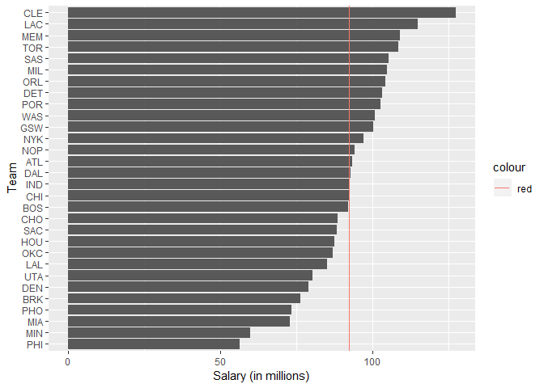
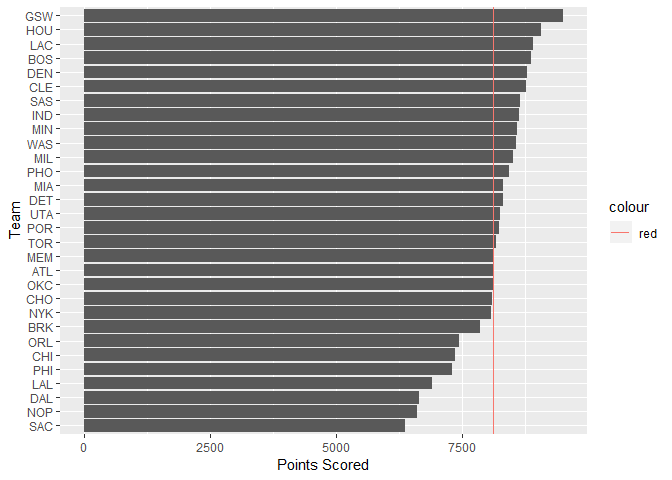
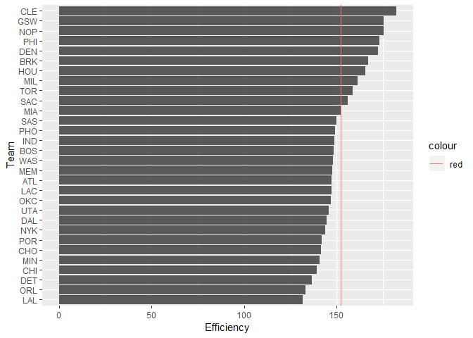
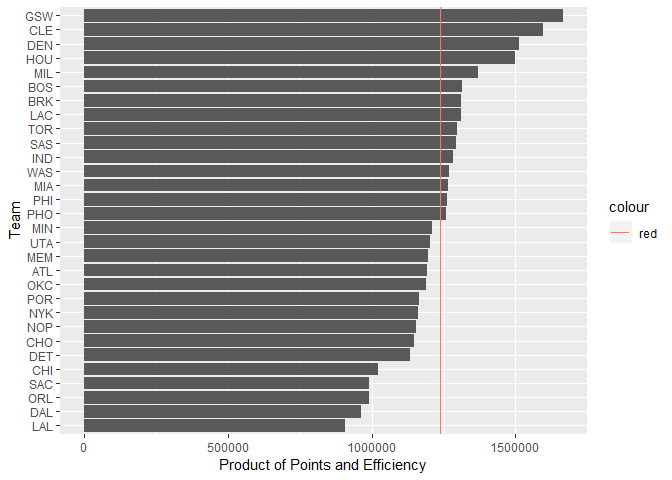

workout01-derek-shue
================
Derek Shue
September 30, 2018

Ranking of Teams
----------------

``` r
library(readr)
library(dplyr)
```

    ## 
    ## Attaching package: 'dplyr'

    ## The following objects are masked from 'package:stats':
    ## 
    ##     filter, lag

    ## The following objects are masked from 'package:base':
    ## 
    ##     intersect, setdiff, setequal, union

``` r
library(ggplot2)
nba <- read_csv("https://raw.githubusercontent.com/ucb-stat133/stat133-fall-2018/master/data/nba2018.csv")
```

    ## Parsed with column specification:
    ## cols(
    ##   .default = col_integer(),
    ##   player = col_character(),
    ##   number = col_character(),
    ##   team = col_character(),
    ##   position = col_character(),
    ##   height = col_character(),
    ##   birth_date = col_character(),
    ##   country = col_character(),
    ##   experience = col_character(),
    ##   college = col_character(),
    ##   salary = col_double(),
    ##   field_goals_perc = col_double(),
    ##   points3_perc = col_double(),
    ##   points2_perc = col_double(),
    ##   effective_field_goal_perc = col_double(),
    ##   points1_perc = col_double()
    ## )

    ## See spec(...) for full column specifications.

``` r
nba$experience[nba$experience == "R"] = 0
nba$experience = as.integer(nba$experience)
nba$salary = nba$salary/1000000
levels(nba$position) <- c("center","power_fwd","small_fwd","shoot_guard","point_guard")
nba <- mutate(nba, missed_fg = field_goals_atts - field_goals)
nba <- mutate(nba, missed_ft = points1_atts - points1)
nba <- mutate(nba, rebounds = off_rebounds + def_rebounds)
nba <- mutate(nba, efficiency = (points + rebounds + assists + steals + blocks - missed_fg - missed_ft - turnovers) / games)
teams <- summarise(group_by(nba, team), experience = sum(experience), salary = sum(salary), points3 = sum(points3), points2 = sum(points2), points1 = sum(points1), points = sum(points), off_rebounds = sum(off_rebounds), def_rebounds = sum(def_rebounds), assists = sum(assists), steals = sum(steals), blocks = sum(blocks), turnovers = sum(turnovers), fouls = sum(fouls), efficiency = sum(efficiency))
```

Ranking by salary:

``` r
ggplot(teams, aes(x = reorder(team,salary), y = salary)) + geom_bar(stat = 'identity') + coord_flip() + labs(x = "Team", y = "Salary (in millions)") + geom_hline(aes(yintercept = mean(teams$salary), color = "red"))
```



Ranking by points:

``` r
ggplot(teams, aes(x = reorder(team,points), y = points)) + geom_bar(stat = 'identity') + coord_flip() + labs(x = "Team", y = "Points Scored") + geom_hline(aes(yintercept = mean(teams$points), color = "red"))
```



Ranking by efficiency:

``` r
ggplot(teams, aes(x = reorder(team,efficiency), y = efficiency)) + geom_bar(stat = 'identity') + coord_flip() + labs(x = "Team", y = "Efficiency") + geom_hline(aes(yintercept = mean(teams$efficiency), color = "red"))
```



Ranking by points and efficiency:

``` r
ggplot(teams, aes(x = reorder(team,points*efficiency), y = points*efficiency)) + geom_bar(stat = 'identity') + coord_flip() + labs(x = "Team", y = "Product of Points and Efficiency") + geom_hline(aes(yintercept = mean(points * efficiency), color = "red"))
```



Basketball is won by scoring more points than the other team. Therefore, points scored is a crucial factor to how good a basketball team is. However, the team also has to score those points efficiently, otherwise it runs the risk of the other team scoring even more points. Therefore, this metric takes the product of points and efficiency. Although we're not supposed to use postseason results as a metric, it's interesting to note that the two teams that met in last year's final (GSW and CLE) are \#1 and \#2 by this metric.

Comments and Reflections
------------------------

-   This was my first time working on a project with such file structure. The organization is nice, but it was definitely time-consuming trying to get the logistics right.
-   This is my first time using relative paths. They are much more practical than including the whole path every time, and it can be followed by outside readers more easily.
-   This was my first time using an R script. It was strange not getting the same type of error messages and not being able to knit the file, but that is most likely just due to being accustomed with markdown.
-   Making plots was still difficult simply because of the wide breadth of possible commands.
-   Figuring out what metric I wanted to use for my NBA analysis was fairly easy even though we haven't done anything similar in class.
-   No one helped me to complete this assignment.
-   This HW took me abaout 5 hours to complete.
-   Creating the data dictionary was extremely time consuming.
-   Learning how to make the plots was interesting.
